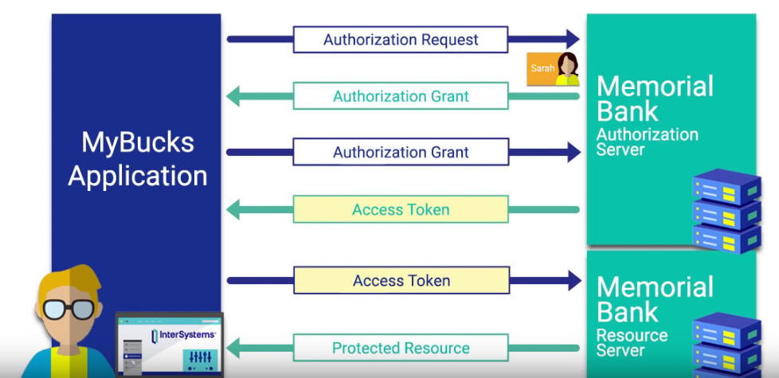
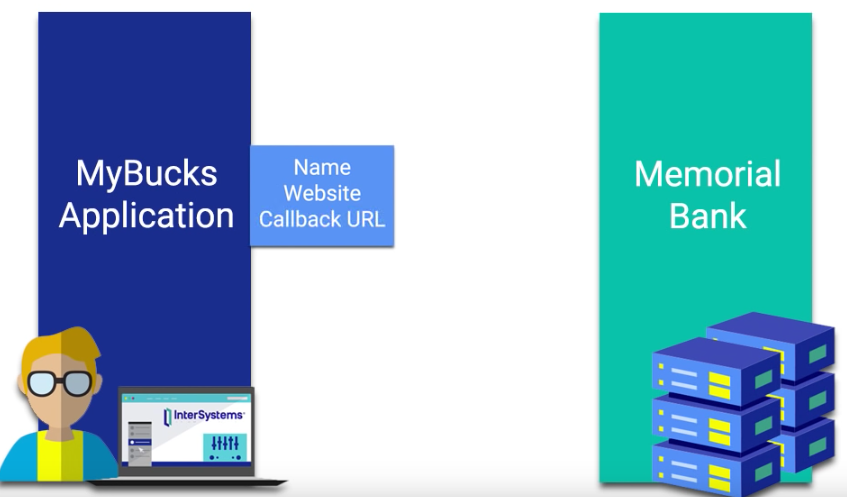
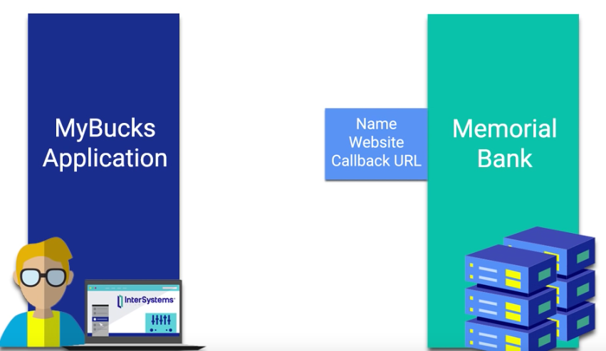
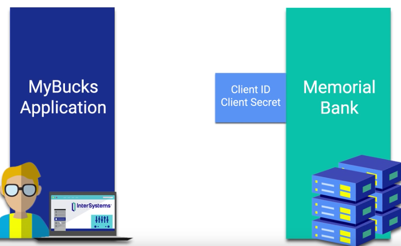
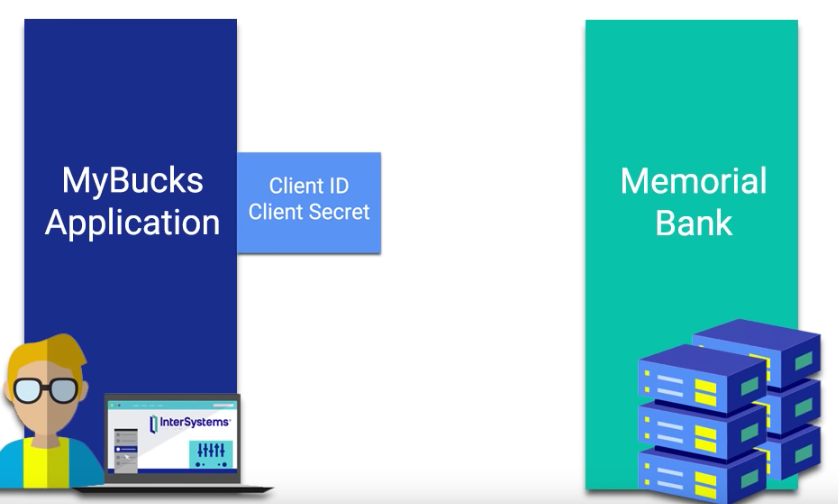

# Definition:
OAuth 2.0 provides users with the ability to grant third-party access to web resources without sharing a password. Updated features available in OAuth 2.0 include new flows, simplified signatures and short-lived tokens with long-lived authorizations.

# Roles:
* User: the person who uses the application.
* Application: the app that requests user’s information
* API: manage the user’s information. Within the API, there is an authentication server and a resource server.

*Comments: Passwords are never passed from server to server in an OAuth 2.0 framework.*

# Workflow of OAuth 2.0:
1. When the user clicked on “connect to memorial bank account”, the application will make an authorization request to the memorial bank’s authorization server. The memorial bank asks the user “do you wish to authorize the app xxx to access your bank account balances and transaction history?”
2. If the user agrees to authorize the app the access the information, an authorization grant is sent back to the app side by the memorial bank along with an authorization code that the app xxx will use when requesting an access token to see the user’s account.
3. The app is going to take the user’s authorization grant including the authorization code, and use it to request an access token from the authorization server at the memorial bank. Note that none of the user’s information is located at the authorization server since this server is only responsible for authorizing the user and providing the proper access token that will eventually allow the app xxx to retrieve the protected info from the resource server.
4. After receiving the authorization granted code sent from the app xxx on behalf of the user, the memorial bank authorization server provides an access token to the app xxx specifically for the user. 
5. This token will be included in the request from the app xxx to the resource server and then provides the app with access to only the things that the user granted the permission to see.
The memorial bank identifies that this token is valid to access those particular pieces of the user’s account. The resource server sends the protected resources that were requested back to the app xxx. And the application now has the user’s information.

Note that the actual authentication of the user occurs with Open ID connect through the use of ID tokens that are passed along with the access tokens shown here.

The developers of the application should register the app with the memorial bank api service. Independent of any users involvement, the developer needs to provide the bank api with the app name, website and the callback url that the bank’s authorization server will redirect the user after they authorize access to their account. After the app provides the necessary information to the bank api service, the bank api will send back a set of credentials to the app. These credentials includes a client ID, which is a public and unique identifier that will be used to identify the app as an application, and a client secret, which is a private identifier kept the secret between the app and the api that is used to authenticate the app when it makes a request for an access token.

In OAuth 2.0, there are four different grant types for different use cases. The grant type we used in the above example is the authorization code grant. 

The other three are:
Implicit grant, Password grant, and Client credentials grant.

